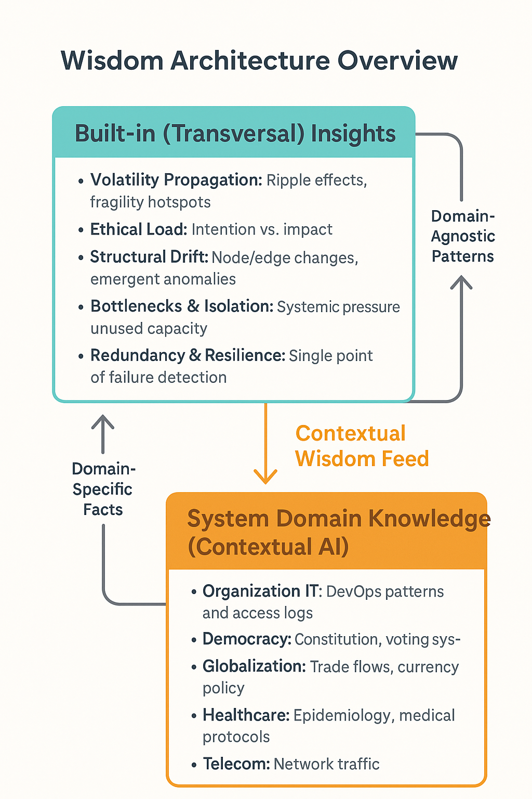

# Agentic AI Wisdom Layer: A Simulated Proof of Concept

This repository presents a dynamic simulation of a **Meta-Agentic AI architecture**, centered around a Wisdom Layer composed of cognitive agents that model **systems behavior**, **volatility**, **ethical tension**, and **emergent complexity**.

---

## 🧠 Core Concept

The Wisdom Layer simulates how **meta-agents**—rooted in Systems Thinking, Chaos Theory, Karma, and Complexity Theory—can collaborate to detect risk, assess ethical load, and forecast systemic fragility in sociotechnical systems.

It operates on a JSON-based mental model that can evolve through human curation or functional inputs. The goal is not just automation, but **cognition**, **foresight**, and **resilience-awareness** in complex adaptive environments.

> ✅ **Note:** This is a partially AI-powered proof of concept. While agent reasoning originated from rule-based modeling, the current version integrates **LLM-powered cognitive agents** (e.g., `smart_prompt()` for Systems Thinking, Chaos Theory, Karma, and Complexity Sentinel). These agents reason on structured JSON-based system models and provide adaptive, explainable insights in real time. This demonstrates a functional **Wisdom Layer**, capable of modeling and interpreting complex system states through AI-enhanced perception.



---

## 🧹 Agents Included

| Agent                     | Role                                                                 |
|--------------------------|----------------------------------------------------------------------|
| **Systems Thinking Agent**   | Detects structure, bottlenecks, isolated nodes, and system dependencies |
| **Chaos Theory Agent**       | Propagates volatility through ripple decay and detects feedback loops  |
| **Karma Agent**              | Calculates ethical load based on intention, impact, and influence       |
| **Complexity Sentinel Agent**| Compares system snapshots to detect emergent changes and drift         |

---

## ⚙️ Technology Stack

- **Python 3.10**
- **Streamlit** for dashboard UI
- **NetworkX** for graph analysis
- **OpenAI API** for agent cognition
- **Docker & GitHub Actions** for CI/CD deployment

---

## 🚀 Features

- ✅ **Volatility-aware Chaos Agent**
- ✅ **Ethics + Ripple Karma Overlay**
- ✅ **Perspective conflict & structural drift detection**
- ✅ **Smart Prompt UI with LLM-ready inputs**
- ✅ **Version-controlled deployment to AWS EC2 via GitHub Actions**

---

## 📃 How to Run

```bash
git clone https://github.com/dathatcher/wisdom-layer-poc.git
cd wisdom-layer-poc
python -m venv venv
source venv/bin/activate
pip install -r requirements.txt
streamlit run app.py
```

> Then upload or modify `systems_model.json` to simulate new scenarios.

---

## 🔮 Sample Use Cases

- “What if `Datadog` fails while `Jane Doe` is out of office?”
- “Who has the highest ethical load and ripple fragility?”
- “What emergent shifts occurred in model version `v1.3` vs. `v1.4`?”

---

## 📘 SSRN Research

**Wisdom Before Code: Architecting Agentic AI through Systems Thinking, Chaos Theory, and Karma**  
✉️ [Read the paper](https://papers.ssrn.com/sol3/papers.cfm?abstract_id=5224492)  
⏳ Published: May 5, 2025

---

## 🔎 Roadmap

- ⏹ Agent orchestration with live system telemetry
- ⏳ Integration with CI/CD logs, Jira, GitHub, observability
- ⏭ Autonomous agents that write back to the model
- ⚖️ DSRP-aligned modeling of perspective conflict

---

## 👤 Author

**David Thatcher**  
Veteran | Systems Thinker | Independent Researcher  
🔗 LinkedIn / GitHub / SSRN

---

## 📝 License

MIT License. All rights reserved. Contact: david.austin.thatcher@gmail.com

---

## 🗓️ Last Updated

June 3, 2025
